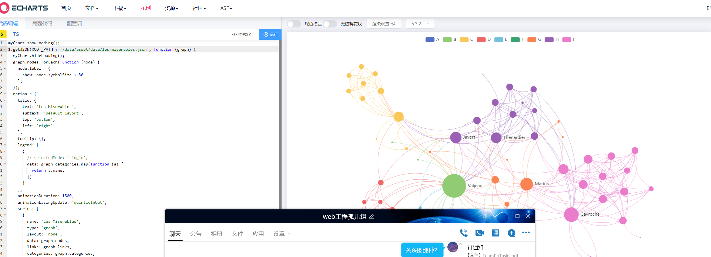
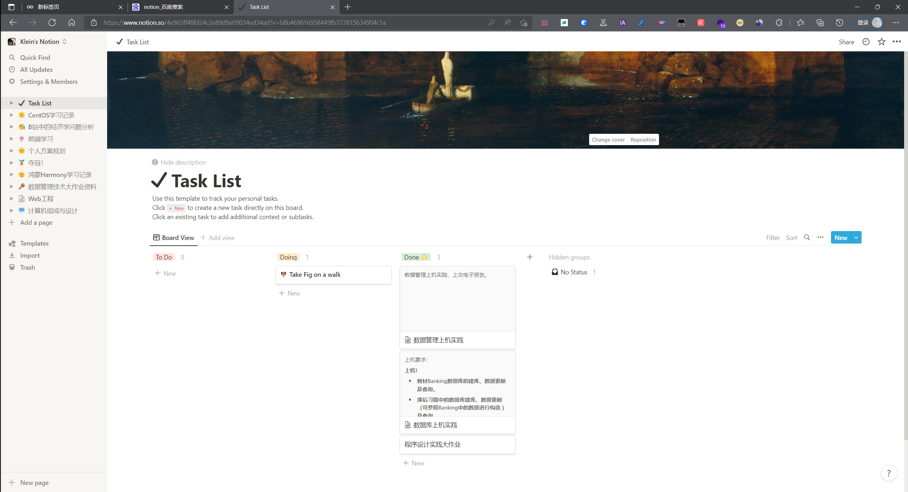

# **“人情世故”需求分析**
（取名无能啊，有想法再换）

项目组：01_web工程孤儿组

## 1.引言

### 编写目的

本文档目的在于明确web项目的需求，界定项目实现功能的范围，知道系统设计以及编码。本文档的预期读者，本小组的每一位成员。

## 2.项目概述

“人情世故”web项目初始目标是面向或是内向，或是细心，或是温柔的每一位想去记录，想去回忆和朋友之间种种事情的社会人。为他们提供一个便于记录、便于回忆、便于抒情的工具。同时项目吸取“互联网棺材”的思想，具备客户“逝世”后一定的自定义功能。

### 项目名称

“人情世故”web项目

### 参考资料

[“互联网棺材”话题引热议，数字遗产该如何处理 (baidu.com)](https://baijiahao.baidu.com/s?id=1724988210485120657&wfr=spider&for=pc)

## 3.主要功能

### 人际关系记事本

由使用者对他想记的人进行记录，好事亦或是坏事，并赋予不同的权重，以此来衡量亲疏关系。该功能更像是没有聊天功能的QQ，取而代之的是对个人的一次次评价，加分减分由自己决定。

### 人际关系展示

基于功能“人际关系记事本”，丰富其表现形式，做到数据可视化——动态关系图。

### ”互联网棺材“部分功能

实现密码托管以及使用者对指定人员的自动回复，实现以邮件的形式发送给指定人员。

## 4.主要页面

### 首页

首页应实现项目名称展示、用户登录以及用户状态（是否已”逝世“）的展示、输入与选择。

### 主页

人物关系动态展示，以及对事件、人物的记录。同时设置跳转，跳转至”第二页“。

页面设计可以借鉴web网页-NOTION。

[notion登陆界面](https://www.notion.so/logout)

### 第二页

该页面实现”互联网棺材“功能。

页面设计可以借鉴网页邮箱设计。

## 5.网站建设过程
由于制作人员教超，网页内容尽可能在信息介绍方面详略得当，做到有的放矢，有效协同开发者共同参与，即使囧六，有组织，有计划的进行资源的管理与分配。

#### 暂时就先这么多了

