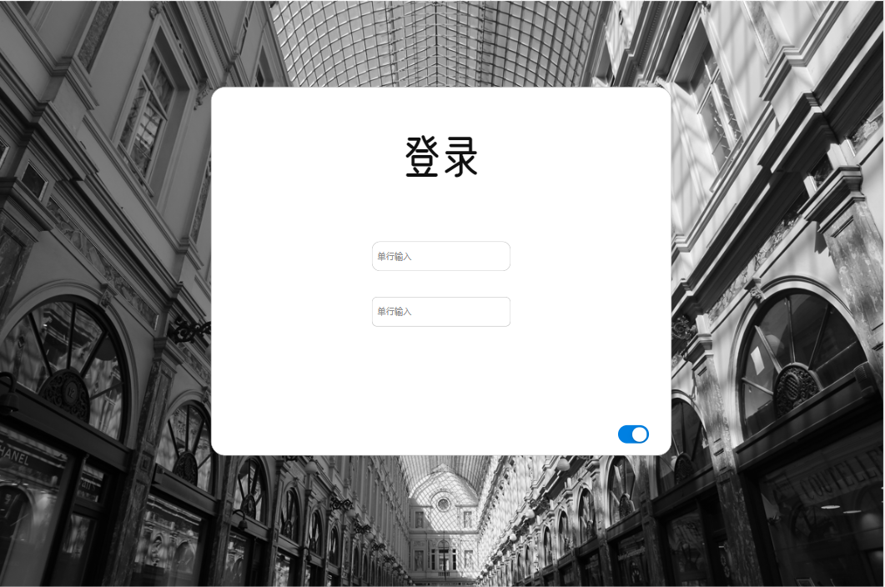
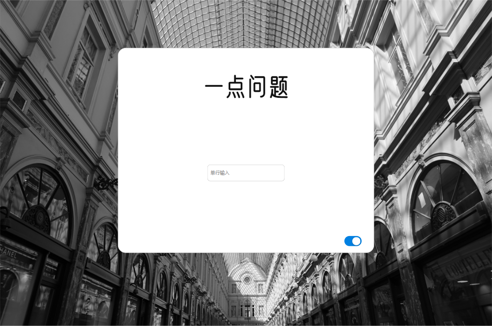
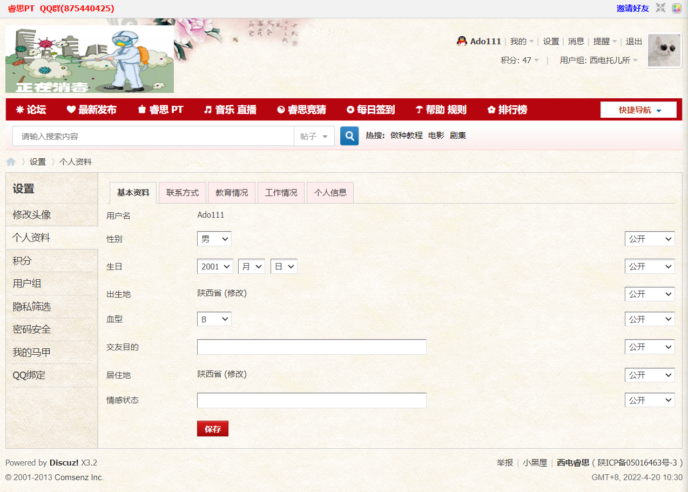

# **“人情世故”需求分析**
（取名无能啊，有想法再换）

项目组：01_web工程孤儿组

## 1.引言

### 编写目的

本文档目的在于明确web项目的需求，界定项目实现功能的范围，知道系统设计以及编码。本文档的预期读者，本小组的每一位成员。

## 2.项目概述

“人情世故”web项目初始目标是面向或是内向，或是细心，或是温柔的每一位想去记录，想去回忆和朋友之间种种事情的社会人。为他们提供一个便于记录、便于回忆、便于抒情的工具。同时项目吸取“互联网棺材”的思想，具备客户“逝世”后一定的自定义功能。

### 项目名称

“人情世故”web项目

### 参考资料

[“互联网棺材”话题引热议，数字遗产该如何处理 (baidu.com)](https://baijiahao.baidu.com/s?id=1724988210485120657&wfr=spider&for=pc)

## 3.主要功能

### 人际关系记事本

由使用者对他想记的人进行记录，好事亦或是坏事，并赋予不同的权重，以此来衡量亲疏关系。该功能更像是没有聊天功能的QQ，取而代之的是对个人的一次次评价，加分减分由自己决定。

### 人际关系展示

基于功能“人际关系记事本”，丰富其表现形式，做到数据可视化——动态关系图。

### ”互联网棺材“部分功能

实现密码托管以及使用者对指定人员的自动回复，实现以邮件的形式发送给指定人员。

---------------------------------------------------------------------------------------------------------------------------
4月19日补充
## 功能需求：
1. 使用人群分为：
   * 普通用户、附属用户
   * 系统
2. 普通用户可以通过主页注册账户
3. 普通用户可以通过主页，使用账号密码登录自己的账户
4. 普通用户可以编辑、修改自己的个人信息
5. 普通用户可以添加关系人物
6. 普通用户可以对关系人物进行人际关系记事，记录和该人物发生的事件
7. 事件分为好事和坏事，因此普通用户可以给关系人物事件打分，好事加分、坏事减分
8. 普通用户可以查看自己的人际关系亲疏图，通过点击图中的节点跳转到该人物的记事本中
9. 普通用户可以在安排界面设置自己的后事安排，包括：

     * 添加一个关系人物，添加他的电子邮箱
     * 给关系人物留下自己对他想说的话
     * 给关系人物留下自己想给他的电子资产
10. 系统可以支持在用户死后，按照后事安排，通过邮件为关系人物发送讣告、同时将遗言内容发送给关系人物
11. 附属用户可以通过回答亲密问题进入确认逝世界面，来发送讣告
#### 附加功能（电子墓碑）：
    1. 发送讣告同时发送唯一身份码
    2. 附属用户通过身份码登录，可以看到用户给他的留言和电子资产

## 非功能性需求
1. 用户数：
2. 数据存储量：
3. 可靠性：
4. 安全性：涉及很多个人隐私，因此...

4月19日补充

--------------------------------------------------------------------------------------------------------------------------------

## 4.主要页面

### 首页

首页应实现项目名称展示、用户登录以及用户状态（是否已”逝世“）的展示、输入与选择。
release_01版本，首页应有两个页面：1.正常的用户登录界面 2.“亲属”问题回答界面

正常登录进入主页；或在右下角进行选择，进入“亲属”问题回答界面

“亲属”问题回答正确，则触发“逝世”的标识。
（以上图仅仅只是大概的想法，设计时不要局限于此）

### 主页

人物关系动态展示，以及对事件、人物的记录。同时设置跳转，跳转至”第二页“。

页面设计可以借鉴web网页-NOTION。

[notion登陆界面](https://www.notion.so/logout)

主页的第一页，应当首先展示用户（actor）的“人际关系动态图”，顶部导航栏右侧设计成类似“西电睿思”（或自行设计）

在人际关系动态图左侧，则是类似QQ好友列表一般的 好友展示。
当我们点击某个人的“好友展示”时，中间的“人际关系图”消失，转变成对这个人专属的“记事本”。
同时也要设定案件，添加“对象”。

主页的第二页，也可以是类似于西电睿思的设置界面。其中我们需要特别添加的功能页-”自动回复“

### 第二页

该页面实现”互联网棺材“功能。

页面设计可以借鉴网页邮箱设计。

”自动回复“-设置想要恢复的内容和对方的邮箱。

## 5.网站建设过程
由于制作人员教超，网页内容尽可能在信息介绍方面详略得当，做到有的放矢，有效协同开发者共同参与，即使囧六，有组织，有计划的进行资源的管理与分配。

#### 暂时就先这么多了

